<div align="center">

<!-- ══════════════════════════════════════════════════════ -->
<!--   REPLACE THIS WITH YOUR BANNER (1280x640 recommended) -->
<!-- ══════════════════════════════════════════════════════ -->
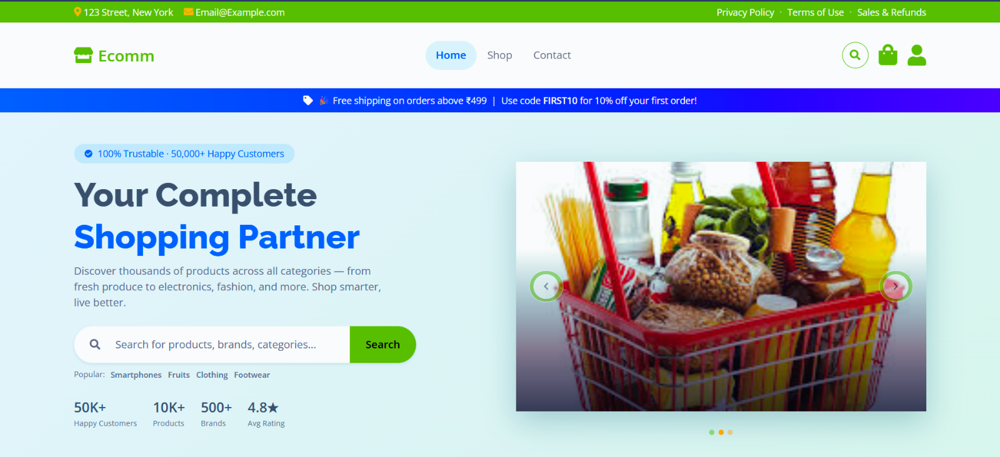

<br/>

# 🛍️ Ecomm — Your Complete Shopping Partner

**A modern, fully responsive full-stack e-commerce platform**
built with the MERN stack, Bootstrap 5, and Razorpay payments.

<br/>

[](https://your-live-url.com)
[](https://your-live-url.com/admin/dashboard)

<br/>


</div>

---

## 🔐 Demo Credentials

> **Try the app instantly — no signup required!**

<div align="center">

| Role | 📧 Email | 🔑 Password | 🔗 Access |
|:----:|:--------:|:-----------:|:---------:|
| 👤 **User** | `user@gmail.com` | `user@123` | [Open App →](https://your-live-url.com) |
| 🛡️ **Admin** | `admin@gmail.com` | `admin@123` | [Admin Panel →](https://your-live-url.com/admin/dashboard) |

</div>

---

## 🎬 App Walkthrough

<div align="center">


> *Browse products → Add to Cart → Checkout → Order Success*

</div>

---

## 📸 Screenshots

### 🏠 Home Page
> Hero carousel, category chips, featured products, bestsellers, offers, testimonials & animated stats

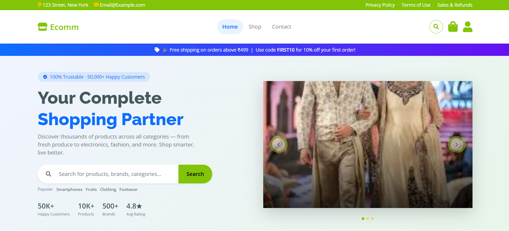

---

### 🛒 Shop Page
> Filter by Category · Brand · Price Range — Grid & List view — Sort options

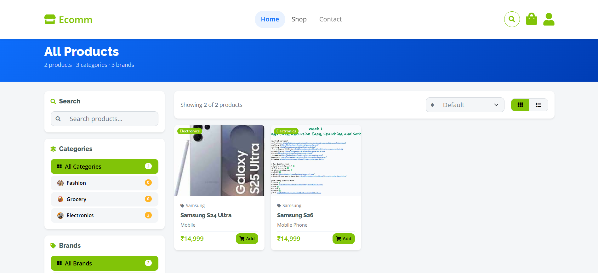

---

### 📄 Product Details
> Image gallery, stock badges, Add to Cart & Buy Now

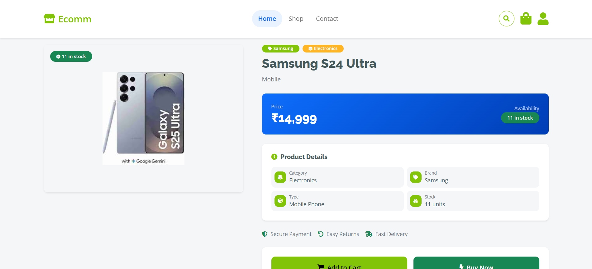

---

### 🧺 Cart & Checkout

| 🛒 Cart | 💳 Checkout |
|:-------:|:-----------:|
| 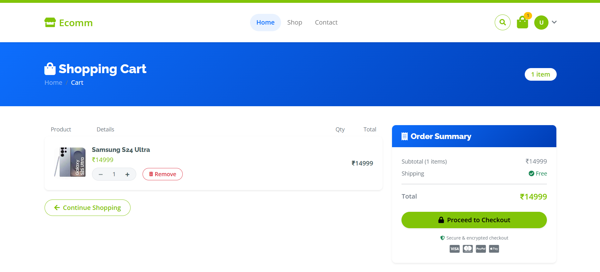 | 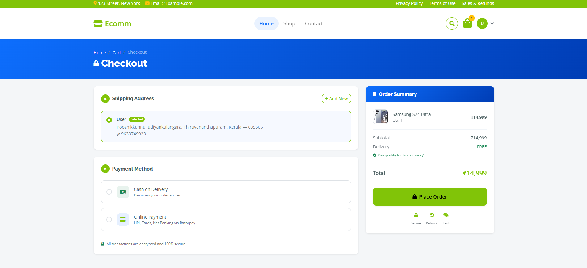 |

---

### ✅ Order Success
> Full order summary, items, delivery address & what-happens-next timeline

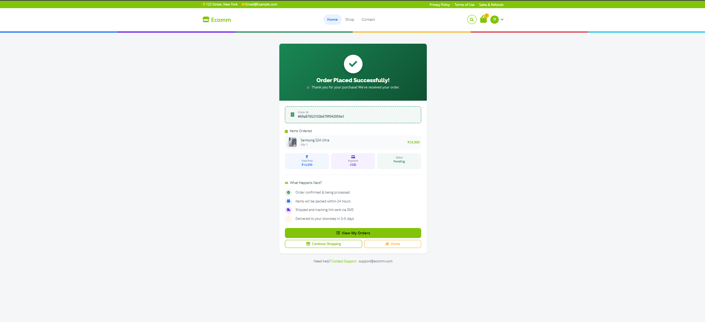

---

### 🛡️ Admin Panel

| 📊 Dashboard | 📦 Products |
|:------------:|:-----------:|
| 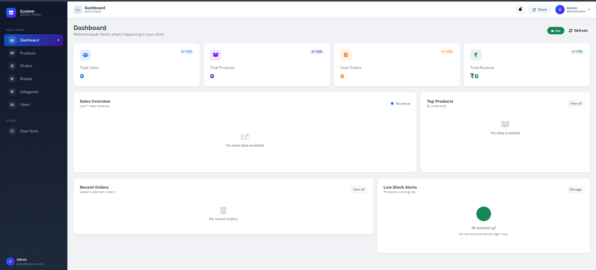 | 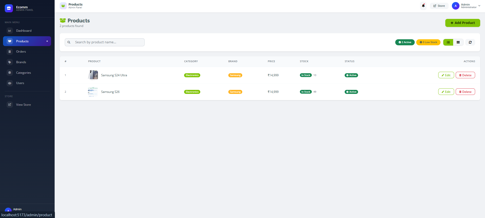 |

| 🛒 Orders | 👥 Users |
|:---------:|:--------:|
| 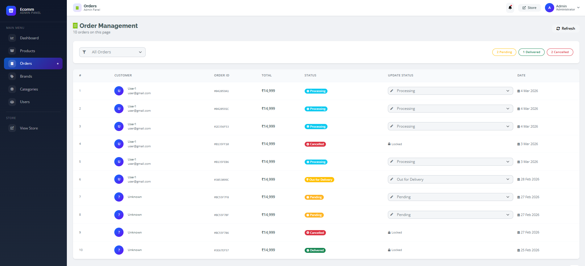 | 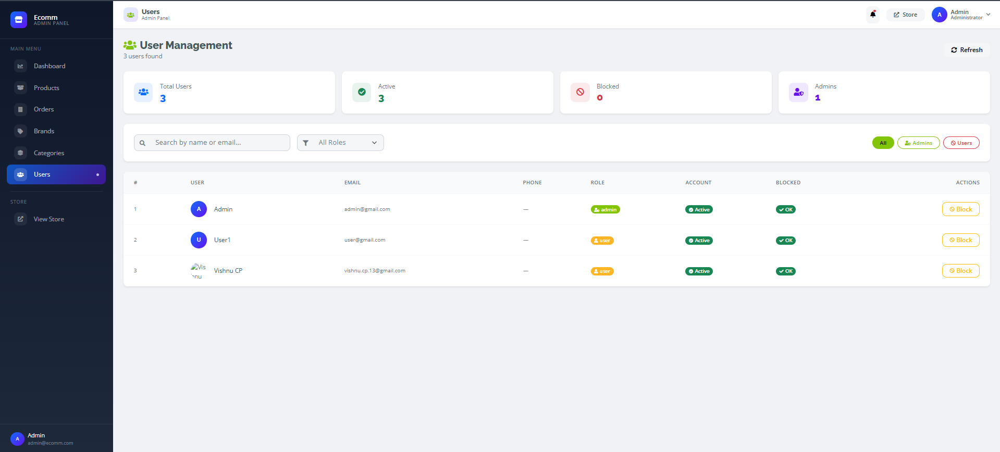 |

---

## ✨ Features

<table>
<tr>
<td valign="top" width="50%">

### 👤 User Features
- 🔐 Signup · Login · **OTP Email Verification**
- 🔍 **Live Search Modal** — real-time results, recent searches, popular tags
- 🏠 **Rich Home Page** — hero carousel, category chips, featured products, bestsellers, animated counter stats, testimonials, promo banners
- 🛒 **Shop Page** — filter by Category + Brand + Price Range, sort, Grid/List toggle
- 📄 **Product Details** — image gallery, stock status, Add to Cart, Buy Now
- 🗂️ **Category Pages** — scoped product browsing with search & sort
- 🧺 **Cart** — add, remove, update quantities
- 📦 **Checkout** — saved addresses, COD & Razorpay, direct Buy Now flow
- 💳 **Razorpay** — UPI, Debit/Credit Cards, Net Banking
- ✅ **Order Success** — order summary, delivery address, timeline
- 📋 **My Orders** — full order history + single order detail view
- 👤 **Profile** — edit info, manage multiple saved addresses

</td>
<td valign="top" width="50%">

### 🛡️ Admin Features
- 📊 **Dashboard** — revenue, orders, users & product stats cards
- 📦 **Products** — full CRUD, multi-image upload, stock management
- 🏷️ **Brands** — full CRUD with logo upload & live preview
- 🗂️ **Categories** — full CRUD with image upload & live preview
- 🛒 **Orders** — view all orders, update order status
- 👥 **Users** — view all users, block/unblock, role management
- 🔒 **Protected Routes** — separate JWT-based auth for admin vs user

</td>
</tr>
</table>

---

## 🛠️ Tech Stack

<table>
<tr>
<th align="center">⚛️ Frontend</th>
<th align="center">🟢 Backend</th>
<th align="center">☁️ Services</th>
</tr>
<tr>
<td>

| Tech | Purpose |
|------|---------|
| React 18 | UI Framework |
| React Router v6 | Client Routing |
| Bootstrap 5 | UI & Responsive |
| Font Awesome 6 | Icons |
| Axios | HTTP Client |
| React Toastify | Notifications |
| Swiper.js | Carousels |
| Vite | Build Tool |

</td>
<td>

| Tech | Purpose |
|------|---------|
| Node.js | Runtime |
| Express.js | REST API |
| MongoDB | Database |
| Mongoose | ODM |
| JWT | Authentication |
| Bcrypt | Password Hash |
| Nodemailer | OTP Emails |
| Multer | File Upload |

</td>
<td>

| Service | Purpose |
|---------|---------|
| MongoDB Atlas | Cloud Database |
| Cloudinary | Image CDN |
| Razorpay | Payments |
| Vercel | Frontend Host |
| Render | Backend Host |

</td>
</tr>
</table>

---

## 📁 Project Structure

```
ecomm/
│
├── 📁 client/                          # React Frontend (Vite)
│   └── 📁 src/
│       ├── 📁 api-helper/              # Axios instance
│       ├── 📁 assets/                  # Images & static files
│       ├── 📁 components/
│       │   ├── 📁 admin/               # AdminLayout, ProtectedAdminRoute
│       │   ├── 📁 user/                # ProtectedUserRoute
│       │   ├── Hero.jsx                # Landing hero + carousel
│       │   ├── Navbar.jsx
│       │   ├── Footer.jsx
│       │   ├── SearchModal.jsx         # Live search overlay
│       │   ├── ProductSection.jsx      # Featured products grid
│       │   ├── ProductDetails.jsx      # Full product detail page
│       │   ├── CategoryPage.jsx        # Category product listing
│       │   ├── BestsellerProducts.jsx
│       │   ├── Services.jsx            # Offer cards
│       │   ├── Testimonials.jsx
│       │   ├── FactsSection.jsx        # Animated stats counter
│       │   ├── Banner.jsx
│       │   ├── BackToTopButton.jsx
│       │   └── Spinners.jsx            # Full-page loader
│       ├── 📁 context/                 # AuthContext, CartContext
│       ├── 📁 pages/
│       │   ├── 📁 admin/               # Dashboard, Products, Orders, Brands, Categories, Users
│       │   ├── Home.jsx
│       │   ├── Shop.jsx                # Full shop with sidebar filters
│       │   ├── Cart.jsx
│       │   ├── Checkout.jsx            # COD + Razorpay + Buy Now
│       │   ├── OrderSuccess.jsx
│       │   ├── MyOrders.jsx
│       │   ├── SingleOrderDetails.jsx
│       │   ├── Profile.jsx
│       │   ├── EditProfile.jsx
│       │   ├── AddressList.jsx
│       │   ├── AddAddress.jsx
│       │   ├── Login.jsx
│       │   ├── SignUp.jsx
│       │   ├── VerifyOtp.jsx
│       │   ├── Contact.jsx
│       │   └── NotFound.jsx
│       └── App.jsx
│
└── 📁 server/                          # Express Backend
    ├── 📁 config/                      # DB & Cloudinary config
    ├── 📁 controllers/                 # Route business logic
    ├── 📁 middleware/                  # Auth & error handlers
    ├── 📁 models/                      # Mongoose schemas
    │   ├── User.js
    │   ├── Product.js
    │   ├── Order.js
    │   ├── Brand.js
    │   ├── Category.js
    │   └── Address.js
    ├── 📁 routes/                      # API route definitions
    └── index.js
```

---

## ⚡ Getting Started

### Prerequisites
```
Node.js v18+   •   MongoDB Atlas account   •   Cloudinary account   •   Razorpay account
```

### 1️⃣ Clone the repository
```bash
git clone https://github.com/vishnu-13-97/Ecommerce

```

### 2️⃣ Backend Setup
```bash
cd backend
npm install
```

Create **`backend/.env`**:
```env
# ── backend ──────────────────────────────
PORT=5000
NODE_ENV=development

# ── Database ─────────────────────────────
MONGODB_URI=mongodb+srv://<user>:<pass>@cluster.mongodb.net/ecomm

# ── Auth ─────────────────────────────────
JWT_SECRET=your_super_secret_key_here
JWT_EXPIRES_IN=7d

# ── Cloudinary ───────────────────────────
CLOUDINARY_CLOUD_NAME=your_cloud_name
CLOUDINARY_API_KEY=your_api_key
CLOUDINARY_API_SECRET=your_api_secret

# ── Email OTP (Gmail) ────────────────────
EMAIL_USER=your_gmail@gmail.com
EMAIL_PASS=your_16_char_app_password

# ── Razorpay ─────────────────────────────
RAZORPAY_KEY_ID=rzp_test_xxxxxxxxxxxx
RAZORPAY_KEY_SECRET=your_razorpay_secret
```

```bash
npm run dev          # → http://localhost:5000
```

### 3️⃣ Frontend Setup
```bash
cd Frontend
npm install
```

Create **`Frontend/.env`**:
```env
VITE_API_URL=http://localhost:5000/api
VITE_RAZORPAY_KEY_ID=rzp_test_xxxxxxxxxxxx
```

```bash
npm run dev          # → http://localhost:5173
```

---

## 🔌 API Reference

<details>
<summary><b>🔐 Authentication</b></summary>

| Method | Endpoint | Auth | Description |
|--------|----------|:----:|-------------|
| `POST` | `/api/auth/signup` | ❌ | Register new user |
| `POST` | `/api/auth/login` | ❌ | Login & receive JWT |
| `POST` | `/api/auth/verify-otp` | ❌ | Verify email OTP |
| `GET` | `/api/auth/me` | ✅ | Get current user |

</details>

<details>
<summary><b>📦 Products</b></summary>

| Method | Endpoint | Auth | Description |
|--------|----------|:----:|-------------|
| `GET` | `/api/product` | ❌ | Get all products |
| `GET` | `/api/product/:id` | ❌ | Get product by ID |
| `POST` | `/api/product` | 🛡️ | Create product |
| `PUT` | `/api/product/:id` | 🛡️ | Update product |
| `DELETE` | `/api/product/:id` | 🛡️ | Delete product |

</details>

<details>
<summary><b>🗂️ Categories & Brands</b></summary>

| Method | Endpoint | Auth | Description |
|--------|----------|:----:|-------------|
| `GET` | `/api/category` | ❌ | Get all categories |
| `POST` | `/api/category` | 🛡️ | Create category |
| `PUT` | `/api/category/:id` | 🛡️ | Update category |
| `DELETE` | `/api/category/:id` | 🛡️ | Delete category |
| `GET` | `/api/brand` | ❌ | Get all brands |
| `POST` | `/api/brand` | 🛡️ | Create brand |
| `PUT` | `/api/brand/:id` | 🛡️ | Update brand |
| `DELETE` | `/api/brand/:id` | 🛡️ | Delete brand |

</details>

<details>
<summary><b>🛒 Cart & Orders</b></summary>

| Method | Endpoint | Auth | Description |
|--------|----------|:----:|-------------|
| `GET` | `/api/user/cart` | ✅ | Get user cart |
| `POST` | `/api/user/cart` | ✅ | Add item to cart |
| `DELETE` | `/api/user/cart/:id` | ✅ | Remove cart item |
| `POST` | `/api/user/orders` | ✅ | Place order |
| `POST` | `/api/user/orders/verify` | ✅ | Verify Razorpay payment |
| `GET` | `/api/user/orders` | ✅ | Get my orders |
| `GET` | `/api/user/orders/:id` | ✅ | Get single order |

</details>

<details>
<summary><b>🏠 Addresses</b></summary>

| Method | Endpoint | Auth | Description |
|--------|----------|:----:|-------------|
| `GET` | `/api/user/address` | ✅ | Get all addresses |
| `POST` | `/api/user/address` | ✅ | Add new address |
| `PUT` | `/api/user/address/:id` | ✅ | Update address |
| `DELETE` | `/api/user/address/:id` | ✅ | Delete address |

</details>

<details>
<summary><b>🛡️ Admin</b></summary>

| Method | Endpoint | Auth | Description |
|--------|----------|:----:|-------------|
| `GET` | `/api/admin/users` | 🛡️ | Get all users |
| `PUT` | `/api/admin/users/:id/block` | 🛡️ | Block / Unblock user |
| `GET` | `/api/admin/orders` | 🛡️ | Get all orders |
| `PUT` | `/api/admin/orders/:id` | 🛡️ | Update order status |
| `GET` | `/api/admin/dashboard` | 🛡️ | Get dashboard stats |

</details>

---

## 💳 Razorpay Payment Flow

```
  User clicks "Place Order"
         │
         ▼
  POST /api/user/orders  ──────────────────▶  Razorpay API
  { addressId, paymentMethod: "Razorpay" }         │
         │                                   Creates Order
         │  ◀──── { razorpayOrderId, amount } ──────┘
         │
  Razorpay Checkout Modal Opens
  (UPI / Cards / Net Banking)
         │
  Payment Completed by User
         │
  POST /api/user/orders/verify
  { razorpay_payment_id,
    razorpay_order_id,
    razorpay_signature }
         │
  Backend verifies HMAC signature
         │
  ✅ Order saved  →  Navigate to /order-success/:id
```

---

## 🌍 Deployment Guide

### Frontend → Vercel
```bash
cd client && npm run build
# Push to GitHub → Import in Vercel → Add env vars → Deploy
```

### Backend → Render
```
1. Connect GitHub repo to Render
2. Build Command  : npm install
3. Start Command  : node index.js
4. Add all .env variables in Render dashboard
```

---

## 📋 Environment Variables Reference

| Variable | Where | Required | Description |
|----------|:-----:|:--------:|-------------|
| `MONGODB_URI` | Server | ✅ | MongoDB Atlas connection string |
| `JWT_SECRET` | Server | ✅ | JWT signing secret (keep private!) |
| `JWT_EXPIRES_IN` | Server | ✅ | Token expiry e.g. `7d` |
| `CLOUDINARY_CLOUD_NAME` | Server | ✅ | Cloudinary cloud name |
| `CLOUDINARY_API_KEY` | Server | ✅ | Cloudinary API key |
| `CLOUDINARY_API_SECRET` | Server | ✅ | Cloudinary API secret |
| `EMAIL_USER` | Server | ✅ | Gmail address for OTP |
| `EMAIL_PASS` | Server | ✅ | Gmail app password (16 chars) |
| `RAZORPAY_KEY_ID` | Server + Client | ✅ | Razorpay Key ID |
| `RAZORPAY_KEY_SECRET` | Server only | ✅ | Razorpay Secret (never expose!) |
| `VITE_API_URL` | Client | ✅ | Backend base URL |

---


## 🤝 Contributing

```bash
# 1. Fork the repo
# 2. Create your feature branch
git checkout -b feature/AmazingFeature

# 3. Commit your changes
git commit -m 'Add AmazingFeature'

# 4. Push to the branch
git push origin feature/AmazingFeature

# 5. Open a Pull Request
```

---

## 📄 License

Distributed under the **MIT License** — see [`LICENSE`](LICENSE) for details.

---

<div align="center">

### 👨‍💻 Built by [Vishnu C P](https://github.com/vishnu-13-97)

[](https://github.com/vishnu-13-97)
[](https://linkedin.com/in/yourprofile)
[](https://yourportfolio.com)

<br/>

⭐ **If this project helped you, please give it a star!** ⭐

<br/>

*Made with ❤️ using React · Node.js · MongoDB*

</div>
